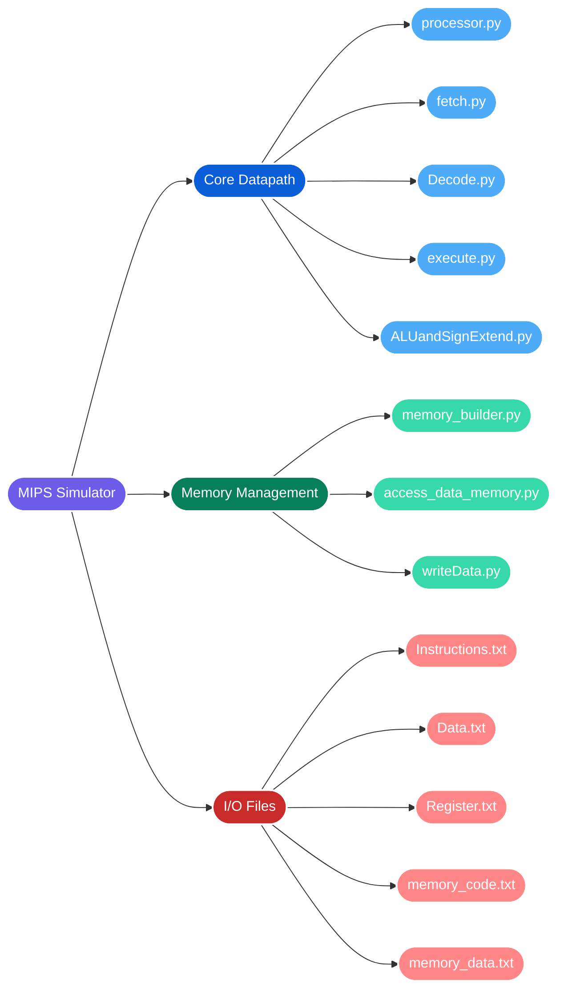
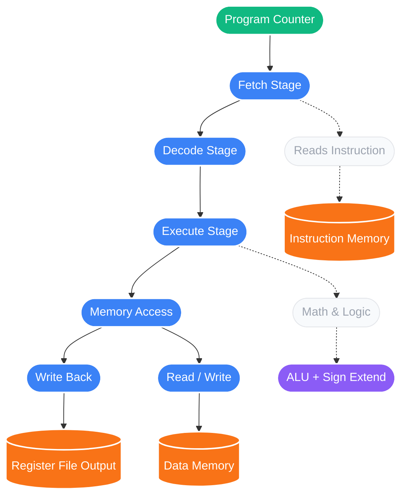
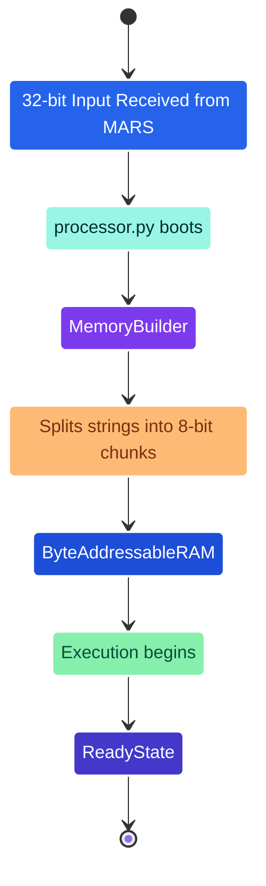

#  MIPS Single-Cycle Processor Simulator

**A cycle-accurate, software-based MIPS datapath simulator.**

MIPS (Microprocessor without Interlocked Pipelined Stages) is a family of Reduced Instruction Set Computer (RISC) architectures designed with an emphasis on simplicity, high performance, and efficient pipelining. 

This project simulates the core functionality of a MIPS processor. Designed to model a streamlined instruction set, this pure Python application accurately replicates the five key stages of execution: Fetch, Decode, Execute, Memory Access, and Writeback without unnecessary complexity. By decoding raw 32-bit machine code and converting it into byte-addressable memory, the simulator dynamically updates architectural states including the Program Counter (PC) and memory addresses cycle-by-cycle.


---

##  Project Structure

Here is exactly how the files are organized within the simulator:



---

##  System Architecture & Datapath

The simulator is built with a highly modular design. The following flowchart maps out the data flow from memory initialization through the processor's main execution loop.



##  Supported Algorithmic Workloads
As part of this project, we implemented three core algorithmic programs in MIPS assembly language:

### Binary Search:
Utilizes a divide-and-conquer approach to efficiently locate the exact index of a target integer (k) within a sorted sequence of n integers, significantly reducing time complexity compared to linear methods.

### Median and Average Calculator:
Analyzes a sequence of integers to compute both the arithmetic mean and the statistical middle of the dataset, handling the necessary logic required for accurate whole-number results.

### Partition Function:
Implements a standard array partitioning algorithm, a core component of QuickSort. It selects a pivot element and rearranges the given sequence so that all values smaller than the pivot precede it, returning the pivot's correct sorted index.

##  How to Run the Simulator
### Memory Initialization State

Before the cycles begin, the simulator automatically handles the memory translation from 32-bit MARS output to 8-bit byte-addressable RAM.



### 1. Load Your Binaries

To execute a new MIPS program, use the copy-paste method to load your machine code into the simulator:

Copy the 32-bit instruction binary from your program and paste it into Instructions.txt.

Copy the 32-bit data binary and paste it into Data.txt

### 2. Execute the Datapath

Open your terminal, navigate to the project directory, and initialize the main processor loop:

```bash
python processor.py
```

### 3. Verify Execution State

Upon encountering a halt loop or a syscall 10, the simulator will safely exit and dump the final processor state:

Check Register.txt for final register values

**At the end of every single clock cycle, the processor's active register state is instantly synced and saved to `Register.txt`    
and, data is instantly synced and saved to `memory_data.txt` for accurate cycle-by-cycle debugging.**

Check memory_data.txt for any variables or arrays written back to RAM via sw instructions.

## 🎓 Academic Context
This simulator was developed as part of EGC 121: Computer Architecture, prepared for Prof. Karthikeyan Vaidyanathan at the International Institute of Information Technology, Bangalore (IIITB).

### Contributors:

Arush Kumar Jain (Roll No: BC2025013)

Ayaan Sharma (Roll No: BC2025017)

Manvik Kumar Gupta (Roll No: BC2025059)


<div align="center">
  <p><i>It’s exactly like a real MIPS processor, except it runs at the blazing fast speed of a Python while loop.</i></p>
</div>


